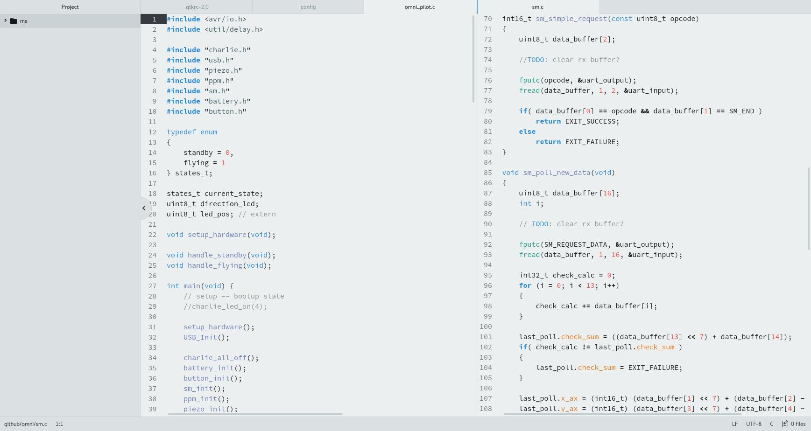

# Cupertino Light

A minimal, light syntax theme for Atom.

Every color was deliberately chosen to reduce eye strain while still maintaing high readability. Unlike most light themes, this one is easy on the eyes as opposed to making you feel like your eyes are going to burn up and fall out of their sockets.

For Visual Studio Code, I like the [Alabaster](https://marketplace.visualstudio.com/items?itemName=tonsky.theme-alabaster) syntax theme using the following modifications to match the colors in this theme:

Comments:                             #ff4845  
Strings:                              #47aa12  
Strings: Escape Sequences:            #8d938d  
Numbers, Characters:                  #6b7db4  
Global definitions of entity names:   #288ad6  
Punctuation:                          #8d938d  

editor.background:                    #eceff0  
editor.lineHighlightBackground:       #eceff0  
panel.background:                     #dfe6e8  
sideBar.background:                   #dfe6e8  
activityBar.background:               #dfe6e8  
activityBar.foreground:               #288ad6  
editorLineNumber.foreground:          #8d938d  
editorCursor.foreground:              #288ad6  

